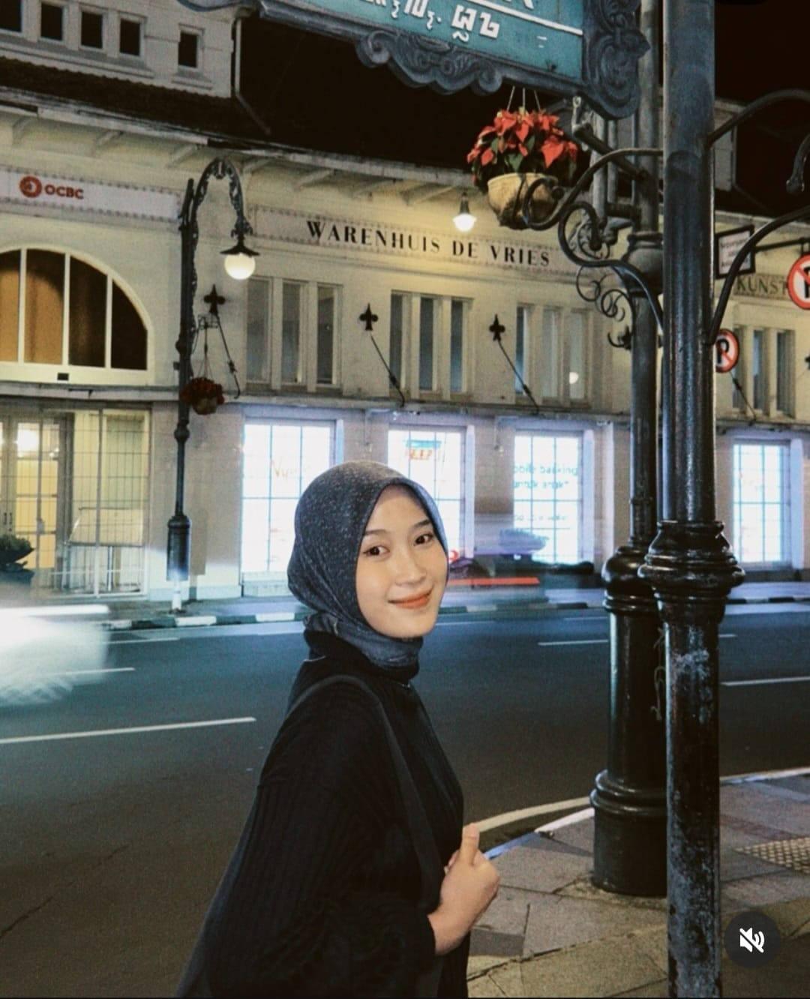
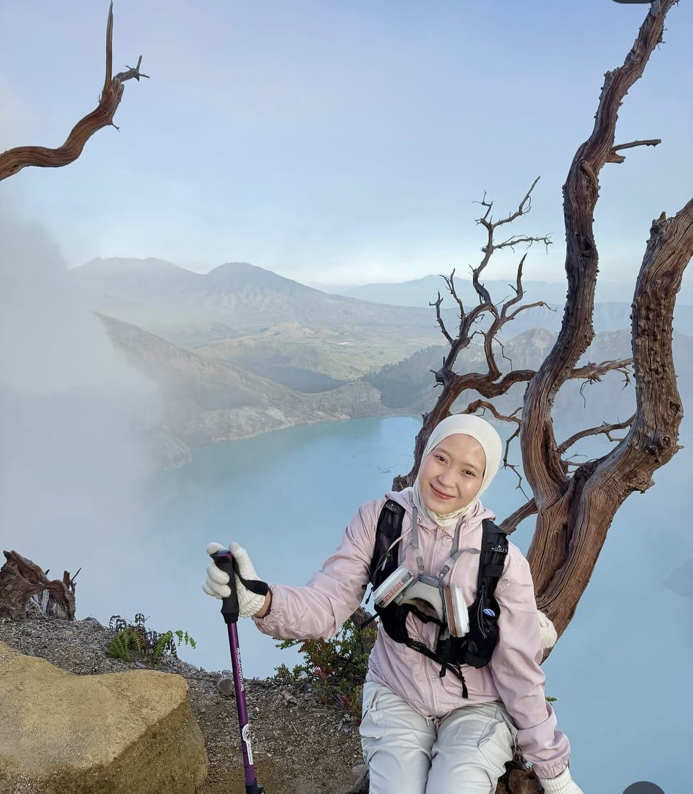

<!DOCTYPE html>
<html lang="id">
<head>
  <meta charset="UTF-8" />
  <meta name="viewport" content="width=device-width, initial-scale=1.0" />
  <title>Happy Birthday, Alfita ✨</title>

  <link rel="preconnect" href="https://fonts.googleapis.com" />
  <link rel="preconnect" href="https://fonts.gstatic.com" crossorigin />
  <link href="https://fonts.googleapis.com/css2?family=Inter:wght@300;400;500;600&family=Playfair+Display:ital,wght@0,400;0,700;1,400&display=swap" rel="stylesheet" />

  
  

  
</head>
<body class="relative">

  <!-- Canvas bintang -->
  <canvas id="starCanvas"></canvas>

  <!-- Background orbs -->
  

  

  

  <!-- Toast notifikasi -->
  
✓ Foto berhasil diganti!

  <!-- Input file tersembunyi untuk ganti foto -->
  <input type="file" id="fileInput" accept="image/*" style="display:none" />

  <!-- ── Tombol Musik ── -->
  

    <button id="musicBtn" title="Play / Mute music" aria-label="Toggle music">
      <svg id="iconPlay" xmlns="http://www.w3.org/2000/svg" width="22" height="22" viewBox="0 0 24 24" fill="none" stroke="#ec4899" stroke-width="2" stroke-linecap="round" stroke-linejoin="round"><polygon points="11 5 6 9 2 9 2 15 6 15 11 19 11 5"></polygon><path d="M15.54 8.46a5 5 0 0 1 0 7.07"></path><path d="M19.07 4.93a10 10 0 0 1 0 14.14"></path></svg>
      <svg id="iconMute" xmlns="http://www.w3.org/2000/svg" width="22" height="22" viewBox="0 0 24 24" fill="none" stroke="#94a3b8" stroke-width="2" stroke-linecap="round" stroke-linejoin="round" style="display:none"><polygon points="11 5 6 9 2 9 2 15 6 15 11 19 11 5"></polygon><line x1="23" y1="9" x2="17" y2="15"></line><line x1="17" y1="9" x2="23" y2="15"></line></svg>
    </button>
    MUSIC
  

  <!-- YouTube IFrame API untuk background musik -->
  <!-- Video ID: Znw0tQCVFfk — "lagu birthday" yang dipilih -->
  

    

  

  <!-- ════════════════════════════════════════
       HERO
  ════════════════════════════════════════ -->
  <section class="relative z-10 min-h-screen flex flex-col items-center justify-center text-center px-6 py-20">

    

      
        <!-- ★ GANTI TANGGAL ★ -->
        Hari Spesialmu
      
    

    <h1 class="font-playfair text-5xl sm:text-7xl lg:text-8xl font-bold mt-6 leading-tight animate-fade-up opacity-0" style="animation-delay:0.5s;animation-fill-mode:forwards;">
      Happy Birthday
    </h1>

    <h2 class="font-playfair italic text-4xl sm:text-6xl lg:text-7xl text-slate-700 mt-2 animate-fade-up opacity-0" style="animation-delay:0.8s;animation-fill-mode:forwards;">
      Mbak Alfita
    </h2>

    

      Semoga hari ini menjadi awal dari bab paling indah dalam hidupmu. 🌸
    

    

      <svg xmlns="http://www.w3.org/2000/svg" width="24" height="24" viewBox="0 0 24 24" fill="none" stroke="#f9a8d4" stroke-width="1.5" stroke-linecap="round" stroke-linejoin="round"><polyline points="7 13 12 18 17 13"></polyline><polyline points="7 6 12 11 17 6"></polyline></svg>
    

  </section>

  <!-- ════════════════════════════════════════
       COUNTDOWN
  ════════════════════════════════════════ -->
  <section class="relative z-10 py-16 px-6">
    

      
Countdown to next birthday

      

      

        🎂 Selamat Ulang Tahun, Mbak Alfita!
      

    

  </section>

  <!-- ════════════════════════════════════════
       KARTU UCAPAN
  ════════════════════════════════════════ -->
  <section class="relative z-10 py-20 px-6">
    

      

        
✦

        

        

          "Di hari yang istimewa ini, semoga setiap langkah yang kamu ambil diterangi cahaya kebahagiaan."
        

        

        

          Mbak Alfita, kamu adalah sosok yang selalu menginspirasi dan memberi semangat bagi orang-orang di sekitarmu.
          Terima kasih sudah ada, sudah berjuang, dan sudah menjadi dirimu yang luar biasa.
          Semoga tahun ini membawa lebih banyak tawa, kesuksesan, dan momen tak terlupakan. 🤍
        

        
— With love, CLAMPER 25

      

    

  </section>

  <!-- ════════════════════════════════════════
       GALERI FOTO
       Klik foto → pilih dari device untuk menggantinya
  ════════════════════════════════════════ -->
  <section class="relative z-10 py-20 px-6">
    

      

        
Memories

        <h3 class="font-playfair text-3xl sm:text-4xl text-slate-700">Momen Berharga</h3>
      

      <!-- Petunjuk edit foto -->
      

        💡 <strong>Klik foto mana saja</strong> untuk menggantinya dengan foto dari perangkatmu
      

      

        <!-- FOTO 1 -->
        

          
          

            <svg xmlns="http://www.w3.org/2000/svg" width="28" height="28" viewBox="0 0 24 24" fill="none" stroke="white" stroke-width="2" stroke-linecap="round" stroke-linejoin="round"><rect x="3" y="3" width="18" height="18" rx="2"/><circle cx="8.5" cy="8.5" r="1.5"/><polyline points="21 15 16 10 5 21"/></svg>
            Ganti Foto
          

        

        <!-- FOTO 2 -->
        

          
          

            <svg xmlns="http://www.w3.org/2000/svg" width="28" height="28" viewBox="0 0 24 24" fill="none" stroke="white" stroke-width="2" stroke-linecap="round" stroke-linejoin="round"><rect x="3" y="3" width="18" height="18" rx="2"/><circle cx="8.5" cy="8.5" r="1.5"/><polyline points="21 15 16 10 5 21"/></svg>
            Ganti Foto
          

        

        <!-- FOTO 3 -->
        

          
          

            <svg xmlns="http://www.w3.org/2000/svg" width="28" height="28" viewBox="0 0 24 24" fill="none" stroke="white" stroke-width="2" stroke-linecap="round" stroke-linejoin="round"><rect x="3" y="3" width="18" height="18" rx="2"/><circle cx="8.5" cy="8.5" r="1.5"/><polyline points="21 15 16 10 5 21"/></svg>
            Ganti Foto
          

        

        <!-- FOTO 4 -->
        

          
          

            <svg xmlns="http://www.w3.org/2000/svg" width="28" height="28" viewBox="0 0 24 24" fill="none" stroke="white" stroke-width="2" stroke-linecap="round" stroke-linejoin="round"><rect x="3" y="3" width="18" height="18" rx="2"/><circle cx="8.5" cy="8.5" r="1.5"/><polyline points="21 15 16 10 5 21"/></svg>
            Ganti Foto
          

        

        <!-- FOTO 5 (wide) -->
        

          
          

            <svg xmlns="http://www.w3.org/2000/svg" width="28" height="28" viewBox="0 0 24 24" fill="none" stroke="white" stroke-width="2" stroke-linecap="round" stroke-linejoin="round"><rect x="3" y="3" width="18" height="18" rx="2"/><circle cx="8.5" cy="8.5" r="1.5"/><polyline points="21 15 16 10 5 21"/></svg>
            Ganti Foto
          

        

        <!-- FOTO 6 -->
        

          
          

            <svg xmlns="http://www.w3.org/2000/svg" width="28" height="28" viewBox="0 0 24 24" fill="none" stroke="white" stroke-width="2" stroke-linecap="round" stroke-linejoin="round"><rect x="3" y="3" width="18" height="18" rx="2"/><circle cx="8.5" cy="8.5" r="1.5"/><polyline points="21 15 16 10 5 21"/></svg>
            Ganti Foto
          

        

        <!-- FOTO 7 -->
        

          
          

            <svg xmlns="http://www.w3.org/2000/svg" width="28" height="28" viewBox="0 0 24 24" fill="none" stroke="white" stroke-width="2" stroke-linecap="round" stroke-linejoin="round"><rect x="3" y="3" width="18" height="18" rx="2"/><circle cx="8.5" cy="8.5" r="1.5"/><polyline points="21 15 16 10 5 21"/></svg>
            Ganti Foto
          

        

        <!-- FOTO 8 -->
        

          
          

            <svg xmlns="http://www.w3.org/2000/svg" width="28" height="28" viewBox="0 0 24 24" fill="none" stroke="white" stroke-width="2" stroke-linecap="round" stroke-linejoin="round"><rect x="3" y="3" width="18" height="18" rx="2"/><circle cx="8.5" cy="8.5" r="1.5"/><polyline points="21 15 16 10 5 21"/></svg>
            Ganti Foto
          

        

        <!-- FOTO 9 -->
        

          
          

            <svg xmlns="http://www.w3.org/2000/svg" width="28" height="28" viewBox="0 0 24 24" fill="none" stroke="white" stroke-width="2" stroke-linecap="round" stroke-linejoin="round"><rect x="3" y="3" width="18" height="18" rx="2"/><circle cx="8.5" cy="8.5" r="1.5"/><polyline points="21 15 16 10 5 21"/></svg>
            Ganti Foto
          

        

        <!-- FOTO 10 -->
        

          
          

            <svg xmlns="http://www.w3.org/2000/svg" width="28" height="28" viewBox="0 0 24 24" fill="none" stroke="white" stroke-width="2" stroke-linecap="round" stroke-linejoin="round"><rect x="3" y="3" width="18" height="18" rx="2"/><circle cx="8.5" cy="8.5" r="1.5"/><polyline points="21 15 16 10 5 21"/></svg>
            Ganti Foto
          

        

        <!-- FOTO 11 (wide) -->
        

          
          

            <svg xmlns="http://www.w3.org/2000/svg" width="28" height="28" viewBox="0 0 24 24" fill="none" stroke="white" stroke-width="2" stroke-linecap="round" stroke-linejoin="round"><rect x="3" y="3" width="18" height="18" rx="2"/><circle cx="8.5" cy="8.5" r="1.5"/><polyline points="21 15 16 10 5 21"/></svg>
            Ganti Foto
          

        

        <!-- FOTO 12 -->
        

          
          

            <svg xmlns="http://www.w3.org/2000/svg" width="28" height="28" viewBox="0 0 24 24" fill="none" stroke="white" stroke-width="2" stroke-linecap="round" stroke-linejoin="round"><rect x="3" y="3" width="18" height="18" rx="2"/><circle cx="8.5" cy="8.5" r="1.5"/><polyline points="21 15 16 10 5 21"/></svg>
            Ganti Foto
          

        

        <!-- FOTO 13 -->
        

          
          

            <svg xmlns="http://www.w3.org/2000/svg" width="28" height="28" viewBox="0 0 24 24" fill="none" stroke="white" stroke-width="2" stroke-linecap="round" stroke-linejoin="round"><rect x="3" y="3" width="18" height="18" rx="2"/><circle cx="8.5" cy="8.5" r="1.5"/><polyline points="21 15 16 10 5 21"/></svg>
            Ganti Foto
          

        

      
<!-- /grid -->
    

  </section>

  <!-- ════════════════════════════════════════
       CTA
  ════════════════════════════════════════ -->
  <section class="relative z-10 py-20 px-6 text-center reveal">
    
A little surprise for you

    <button class="btn-primary" id="surpriseBtn">
      ✨ &nbsp; Buka Hadiah Spesialmu
    </button>
  </section>

  <!-- ════════════════════════════════════════
       FOOTER
  ════════════════════════════════════════ -->
  <footer class="relative z-10 text-center py-10 px-6">
    

    
Made with 💙 for Mbak Alfita · CLAMPER 25

    
✦ ✦ ✦

  </footer>

  <!-- ════════════════════════════════════════
       OVERLAY PESAN TERSEMBUNYI
  ════════════════════════════════════════ -->
  

    

      
🎁

      <h3 class="font-playfair text-2xl text-slate-700 mb-3">Hei Mbak Alfita, ini untukmu!</h3>
      

        Setiap kali kamu tersenyum, dunia menjadi tempat yang sedikit lebih baik.
        Teruslah bersinar, karena cahayamu menginspirasi banyak orang di sekitarmu.
        Selamat ulang tahun — semoga ini menjadi tahun terbaikmu! 🌟
          
        — Dengan penuh sayang, CLAMPER 25
      

      <button onclick="closeSecret()" class="btn-primary text-sm px-8 py-3">Tutup &nbsp; ✕</button>
    

  

  <!-- ════════════════════════════════════════
       JAVASCRIPT
  ════════════════════════════════════════ -->
  

</body>
</html>
